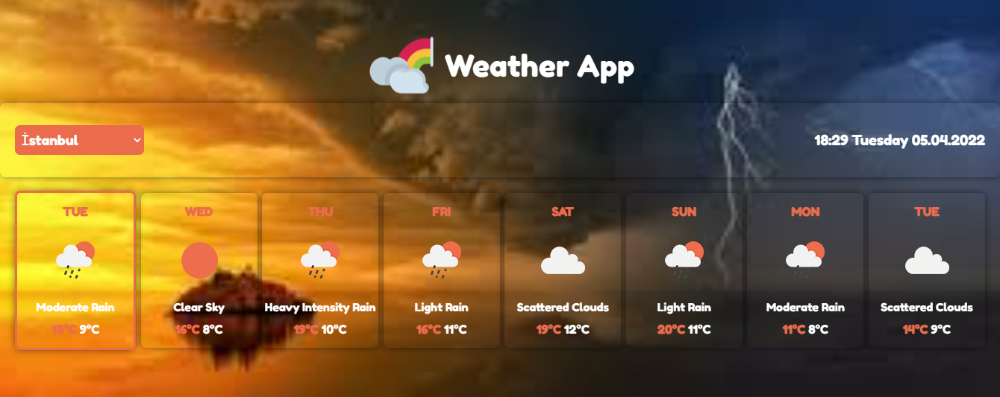
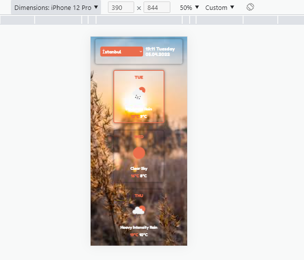

# React-WeatherApp
Patika.dev React modülü "Weather App" çalışması.


* ```Fetch API``` ile hava durumu bilgileri [www.openweathermap.org](https://openweathermap.org/) adresinden çekildi.
* ```Navigator Geolocation API``` ile kullanıcı konumu koordinatları alımnaktadır.
* Projede ```Context API ``` kullanıldı.
* Şehir bilgilerini içeren JSON dosyası: [Cities of JSON](https://gist.github.com/ozdemirburak)
* Browserda kulllanıcınım tercih ermiş olduğu dile göre uygulama **dil** değiştirmektedir.
* İlk açılışta, bulunmuş konum yoksa otomatik olarak konum aranıp **Türkiyeden** şehir bulunmaktadır. Şehir bulunamazsa önceki kapanışta bakılan son şehir gelnektedir. O da yoksa varsayılan olarak **Ankara** gelmektedir.
* Kullanıcının şehri değiştiğnde. Uygulama ekranındaki düğmeyle yeni yerini bulmaktadır.



